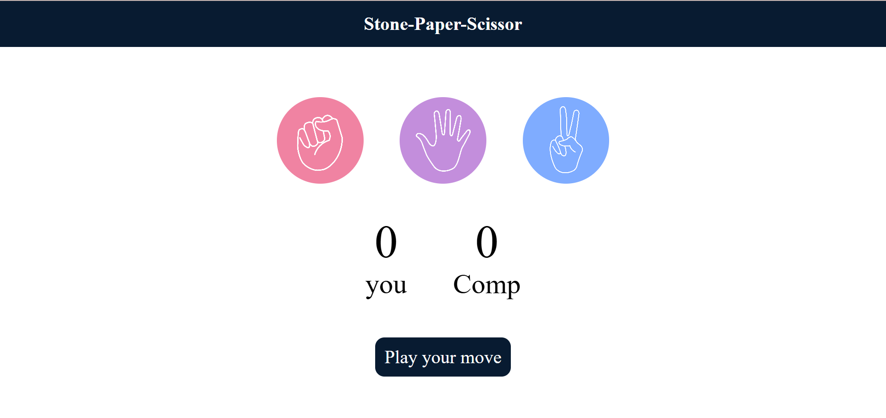

# Stone-Paper-Scissor
🎮 A simple Rock-Paper-Scissors game built with HTML, CSS, and JavaScript. Play against the computer and track your score in real time!
# 🪨 Stone-Paper-Scissor Game 🎮

This is a simple and interactive **Stone-Paper-Scissor** game built using **HTML**, **CSS**, and **JavaScript**. The player competes against the computer, and the first to score more points wins. The game is fully functional and visually engaging with real-time score updates and feedback messages.

---

## 🛠️ Features

- Responsive and clean UI
- Interactive gameplay with click events
- Real-time score tracking
- Random computer choice generation
- Visual feedback for each round

---

## 🧩 Tech Stack

- **HTML** – structure of the page
- **CSS** – styling and layout
- **JavaScript** – game logic and interactivity

---

## 📂 Project Structure
stone-paper-scissor
 index.html         # Main HTML file (game UI and structure)
 style.css          # CSS file for styling the UI
 script.js           # JavaScript file for game logic
 rock.png          # Image for the rock choice
 paper.png         # Image for the paper choice
 scissors.png      # Image for the scissors choice
 Homepage.png    # Screenshot of the homepage (for README)

## 🚀 How to Run

1. Clone or download the project files.
2. Make sure all images (`rock.png`, `paper.png`, `scissors.png`) are in the same folder.
3. Open `index.html` in your browser.
4. Play and enjoy the game!

---
## 🙌 Acknowledgements

This project was made as a fun practice to learn and implement basic front-end web development concepts.

---

